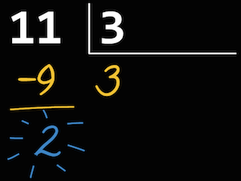

#Modulo
Modulo is one of the many Javascript operators. 

It is represented by the `%` symbol and it evaluates the remainder of a division.

E.g., six fits entirely into 15 twice, with three left over (the remainder).

###Example 1

```javascript
var result = 11 % 3;

console.log(result); //prints 2
```

`3` goes into `11` in its entirety, _three_ times (3 &times; 3 = 9). This leaves a remainder of two. Making `result` equal `2` (11 - 9 = 2).



###Example 2

```
var resultTwo = 25 % 3.5;
```

In this example `resultTwo` equals `0.5` as `3.5` goes into `25` _seven_ times (3.5 &times; 7 = 24.5), leaving a remainder of `0.5`.


##Katas

Here is a kata I created to practise using modulo:

[Paperboy](http://www.codewars.com/kata/56ed5f13c4e5d6c5b3000745/edit/javascript)


Here are some example katas that can be solved with the modulo operator:

[Fizz Buzz](http://www.codewars.com/kata/5300901726d12b80e8000498)

[Normalizing out of range array indexes](http://www.codewars.com/kata/5285bf61f8fc1b181700024c)

##Documentation

Here's a link to the documentation of the modulo operator:

[Remainder operator](https://developer.mozilla.org/en-US/docs/Web/JavaScript/Reference/Operators/Arithmetic_Operators#Remainder)


 
 
