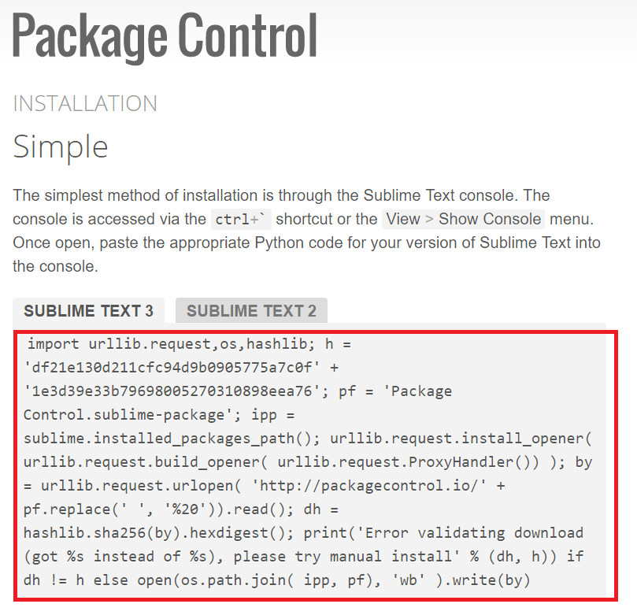

#Setting Up Your Development Environment

Taking the time to properly set up your text editor massively speeds up your workflow in the long-run. Do it!

##Sublime Text 3

###Download and Installation
Begin by downloading and installing Sublime [here](https://www.sublimetext.com/).

###Package Control
Package Control allows you to add custom features ("packages") to Sublime. 

To get started, install Package Control by copying the code listed [here](https://packagecontrol.io/installation).
The code to copy is shown in the red box, below.

Next, open Sublime. Select "View" --> "Show Console".

Paste the red-box code into the console and hit "Enter".

Once the installation is complete, close and re-open Sublime to allow it to update.

To test that the installation was succesful, type CTRL-SHIFT-P (CMD-SHIFT-P) and begin typing "install package". You should see an option appear
called "Package Control: Install Package". Select this option to begin searching for and installing new packages!

###Packages

Packages are customizing add-on features for your text editor. There are tons of them available for Sublime! Remember that some packages come with their own READMEs that detail how to correctly install them.

* Colour scheme packages:
These alter the colours of your code. Recommended: **Dayle Rees Colour Schemes**. This package includes many different colour schems that you can test out and pick our favourite one of.

* Themes:
These alter the entire aesthetic of your workspace, including things like folder icons appearance. Recommended: **Predawn**.

*Bracket Highlighter:
This package will visually match any bracket with its partner bracket when you click on it. This is extremely useful when dealing with nested blocks of code! Recommended: **BracketHighlighter**.

* Linter:
This automatically checks for typos and small errors in your lines of code

##Atom

##Brackets
